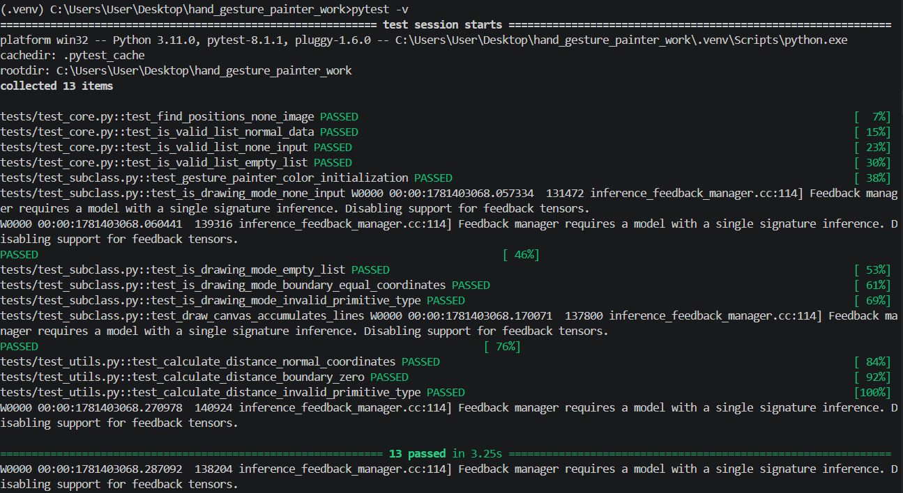
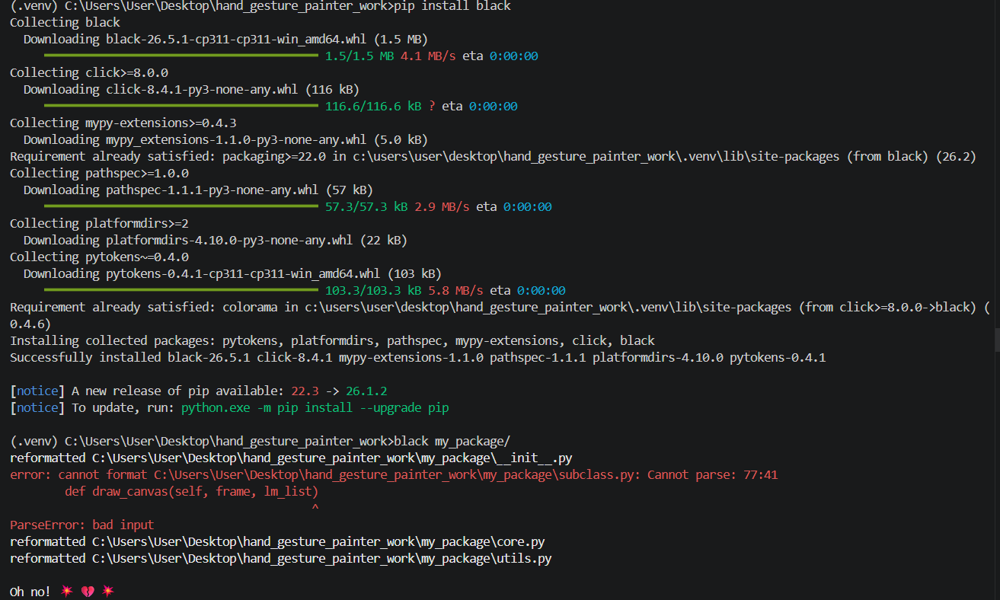
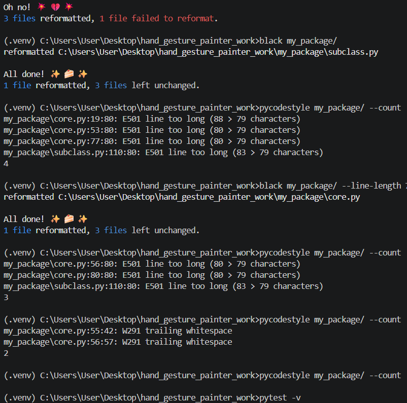
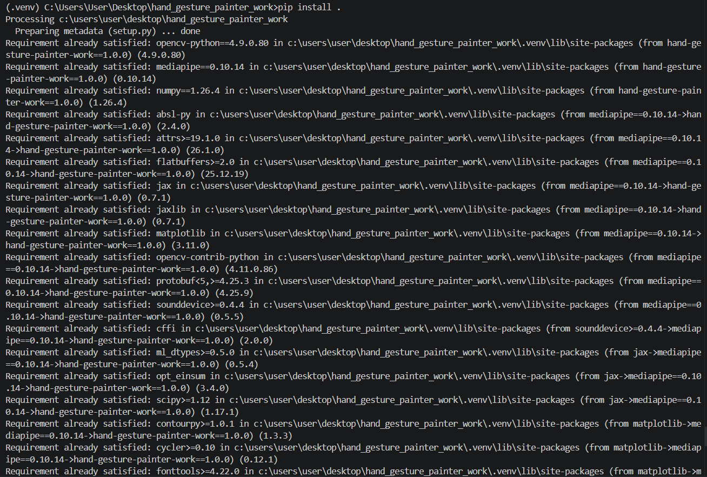
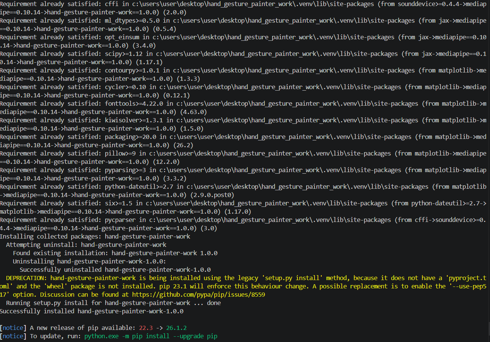

pytest 실행결과
(.venv) C:\Users\User\Desktop\hand_gesture_painter_work>pytest -v 
============================================================ test session starts =============================================================
platform win32 -- Python 3.11.0, pytest-8.1.1, pluggy-1.6.0 -- C:\Users\User\Desktop\hand_gesture_painter_work\.venv\Scripts\python.exe
cachedir: .pytest_cache
rootdir: C:\Users\User\Desktop\hand_gesture_painter_work
collected 13 items                                                                                                                            

tests/test_core.py::test_find_positions_none_image PASSED                                                                               [  7%]
tests/test_core.py::test_is_valid_list_normal_data PASSED                                                                               [ 15%]
tests/test_core.py::test_is_valid_list_none_input PASSED                                                                                [ 23%]
tests/test_core.py::test_is_valid_list_empty_list PASSED                                                                                [ 30%]
tests/test_subclass.py::test_gesture_painter_color_initialization PASSED                                                                [ 38%]
tests/test_subclass.py::test_is_drawing_mode_none_input W0000 00:00:1781403068.057334  131472 inference_feedback_manager.cc:114] Feedback manager requires a model with a single signature inference. Disabling support for feedback tensors.
W0000 00:00:1781403068.060441  139316 inference_feedback_manager.cc:114] Feedback manager requires a model with a single signature inference. Disabling support for feedback tensors.
PASSED                                                                          [ 46%]
tests/test_subclass.py::test_is_drawing_mode_empty_list PASSED                                                                          [ 53%]
tests/test_subclass.py::test_is_drawing_mode_boundary_equal_coordinates PASSED                                                          [ 61%]
tests/test_subclass.py::test_is_drawing_mode_invalid_primitive_type PASSED                                                              [ 69%]
tests/test_subclass.py::test_draw_canvas_accumulates_lines W0000 00:00:1781403068.170071  137800 inference_feedback_manager.cc:114] Feedback manager requires a model with a single signature inference. Disabling support for feedback tensors.
PASSED                                                                       [ 76%]
tests/test_utils.py::test_calculate_distance_normal_coordinates PASSED                                                                  [ 84%]
tests/test_utils.py::test_calculate_distance_boundary_zero PASSED                                                                       [ 92%]
tests/test_utils.py::test_calculate_distance_invalid_primitive_type PASSED                                                              [100%]
W0000 00:00:1781403068.270978  140924 inference_feedback_manager.cc:114] Feedback manager requires a model with a single signature inference. Disabling support for feedback tensors.

============================================================= 13 passed in 3.25s =============================================================
W0000 00:00:1781403068.287092  138204 inference_feedback_manager.cc:114] Feedback manager requires a model with a single signature inference. Disabling support for feedback tensors.

pycodestyle 실행결과

(.venv) C:\Users\User\Desktop\hand_gesture_painter_work>pip install black                                 
Collecting black
  Downloading black-26.5.1-cp311-cp311-win_amd64.whl (1.5 MB)
     ━━━━━━━━━━━━━━━━━━━━━━━━━━━━━━━━━━━━━━━━ 1.5/1.5 MB 4.1 MB/s eta 0:00:00
Collecting click>=8.0.0
  Downloading click-8.4.1-py3-none-any.whl (116 kB)
     ━━━━━━━━━━━━━━━━━━━━━━━━━━━━━━━━━━━━━━━━ 116.6/116.6 kB ? eta 0:00:00
Collecting mypy-extensions>=0.4.3
  Downloading mypy_extensions-1.1.0-py3-none-any.whl (5.0 kB)
Requirement already satisfied: packaging>=22.0 in c:\users\user\desktop\hand_gesture_painter_work\.venv\lib\site-packages (from black) (26.2)
Collecting pathspec>=1.0.0
  Downloading pathspec-1.1.1-py3-none-any.whl (57 kB)
     ━━━━━━━━━━━━━━━━━━━━━━━━━━━━━━━━━━━━━━━━ 57.3/57.3 kB 2.9 MB/s eta 0:00:00
Collecting platformdirs>=2
  Downloading platformdirs-4.10.0-py3-none-any.whl (22 kB)
Collecting pytokens~=0.4.0
  Downloading pytokens-0.4.1-cp311-cp311-win_amd64.whl (103 kB)
     ━━━━━━━━━━━━━━━━━━━━━━━━━━━━━━━━━━━━━━━━ 103.3/103.3 kB 5.8 MB/s eta 0:00:00
Requirement already satisfied: colorama in c:\users\user\desktop\hand_gesture_painter_work\.venv\lib\site-packages (from click>=8.0.0->black) (0.4.6)
Installing collected packages: pytokens, platformdirs, pathspec, mypy-extensions, click, black
Successfully installed black-26.5.1 click-8.4.1 mypy-extensions-1.1.0 pathspec-1.1.1 platformdirs-4.10.0 pytokens-0.4.1

[notice] A new release of pip available: 22.3 -> 26.1.2
[notice] To update, run: python.exe -m pip install --upgrade pip

(.venv) C:\Users\User\Desktop\hand_gesture_painter_work>black my_package/
reformatted C:\Users\User\Desktop\hand_gesture_painter_work\my_package\__init__.py
error: cannot format C:\Users\User\Desktop\hand_gesture_painter_work\my_package\subclass.py: Cannot parse: 77:41
        def draw_canvas(self, frame, lm_list)
                                            ^
ParseError: bad input
reformatted C:\Users\User\Desktop\hand_gesture_painter_work\my_package\core.py
reformatted C:\Users\User\Desktop\hand_gesture_painter_work\my_package\utils.py

Oh no! 💥 💔 💥
3 files reformatted, 1 file failed to reformat.

(.venv) C:\Users\User\Desktop\hand_gesture_painter_work>black my_package/
reformatted C:\Users\User\Desktop\hand_gesture_painter_work\my_package\subclass.py

All done! ✨ 🍰 ✨
1 file reformatted, 3 files left unchanged.

(.venv) C:\Users\User\Desktop\hand_gesture_painter_work>pycodestyle my_package/ --count
my_package\core.py:19:80: E501 line too long (88 > 79 characters)
my_package\core.py:53:80: E501 line too long (80 > 79 characters)
my_package\core.py:77:80: E501 line too long (80 > 79 characters)
my_package\subclass.py:110:80: E501 line too long (83 > 79 characters)
4

(.venv) C:\Users\User\Desktop\hand_gesture_painter_work>black my_package/ --line-length 79
reformatted C:\Users\User\Desktop\hand_gesture_painter_work\my_package\core.py

All done! ✨ 🍰 ✨
1 file reformatted, 3 files left unchanged.

(.venv) C:\Users\User\Desktop\hand_gesture_painter_work>pycodestyle my_package/ --count
my_package\core.py:56:80: E501 line too long (80 > 79 characters)
my_package\core.py:80:80: E501 line too long (80 > 79 characters)
my_package\subclass.py:110:80: E501 line too long (83 > 79 characters)
3

(.venv) C:\Users\User\Desktop\hand_gesture_painter_work>pycodestyle my_package/ --count
my_package\core.py:55:42: W291 trailing whitespace
my_package\core.py:56:57: W291 trailing whitespace
2

(.venv) C:\Users\User\Desktop\hand_gesture_painter_work>pycodestyle my_package/ --count

pip install . 출력 캡처

(.venv) C:\Users\User\Desktop\hand_gesture_painter_work>pip install .  
Processing c:\users\user\desktop\hand_gesture_painter_work
  Preparing metadata (setup.py) ... done
Requirement already satisfied: opencv-python==4.9.0.80 in c:\users\user\desktop\hand_gesture_painter_work\.venv\lib\site-packages (from hand-gesture-painter-work==1.0.0) (4.9.0.80)
Requirement already satisfied: mediapipe==0.10.14 in c:\users\user\desktop\hand_gesture_painter_work\.venv\lib\site-packages (from hand-gesture-painter-work==1.0.0) (0.10.14)
Requirement already satisfied: numpy==1.26.4 in c:\users\user\desktop\hand_gesture_painter_work\.venv\lib\site-packages (from hand-gesture-painter-work==1.0.0) (1.26.4)
Requirement already satisfied: absl-py in c:\users\user\desktop\hand_gesture_painter_work\.venv\lib\site-packages (from mediapipe==0.10.14->hand-gesture-painter-work==1.0.0) (2.4.0)
Requirement already satisfied: attrs>=19.1.0 in c:\users\user\desktop\hand_gesture_painter_work\.venv\lib\site-packages (from mediapipe==0.10.14->hand-gesture-painter-work==1.0.0) (26.1.0)
Requirement already satisfied: flatbuffers>=2.0 in c:\users\user\desktop\hand_gesture_painter_work\.venv\lib\site-packages (from mediapipe==0.10.14->hand-gesture-painter-work==1.0.0) (25.12.19)
Requirement already satisfied: jax in c:\users\user\desktop\hand_gesture_painter_work\.venv\lib\site-packages (from mediapipe==0.10.14->hand-gesture-painter-work==1.0.0) (0.7.1)
Requirement already satisfied: jaxlib in c:\users\user\desktop\hand_gesture_painter_work\.venv\lib\site-packages (from mediapipe==0.10.14->hand-gesture-painter-work==1.0.0) (0.7.1)
Requirement already satisfied: matplotlib in c:\users\user\desktop\hand_gesture_painter_work\.venv\lib\site-packages (from mediapipe==0.10.14->hand-gesture-painter-work==1.0.0) (3.11.0)
Requirement already satisfied: opencv-contrib-python in c:\users\user\desktop\hand_gesture_painter_work\.venv\lib\site-packages (from mediapipe==0.10.14->hand-gesture-painter-work==1.0.0) (4.11.0.86)
Requirement already satisfied: protobuf<5,>=4.25.3 in c:\users\user\desktop\hand_gesture_painter_work\.venv\lib\site-packages (from mediapipe==0.10.14->hand-gesture-painter-work==1.0.0) (4.25.9)
Requirement already satisfied: sounddevice>=0.4.4 in c:\users\user\desktop\hand_gesture_painter_work\.venv\lib\site-packages (from mediapipe==0.10.14->hand-gesture-painter-work==1.0.0) (0.5.5)
Requirement already satisfied: cffi in c:\users\user\desktop\hand_gesture_painter_work\.venv\lib\site-packages (from sounddevice>=0.4.4->mediapipe==0.10.14->hand-gesture-painter-work==1.0.0) (2.0.0)
Requirement already satisfied: ml_dtypes>=0.5.0 in c:\users\user\desktop\hand_gesture_painter_work\.venv\lib\site-packages (from jax->mediapipe==0.10.14->hand-gesture-painter-work==1.0.0) (0.5.4)
Requirement already satisfied: opt_einsum in c:\users\user\desktop\hand_gesture_painter_work\.venv\lib\site-packages (from jax->mediapipe==0.10.14->hand-gesture-painter-work==1.0.0) (3.4.0)
Requirement already satisfied: scipy>=1.12 in c:\users\user\desktop\hand_gesture_painter_work\.venv\lib\site-packages (from jax->mediapipe==0.10.14->hand-gesture-painter-work==1.0.0) (1.17.1)
Requirement already satisfied: contourpy>=1.0.1 in c:\users\user\desktop\hand_gesture_painter_work\.venv\lib\site-packages (from matplotlib->mediapipe==0.10.14->hand-gesture-painter-work==1.0.0) (1.3.3)
Requirement already satisfied: cycler>=0.10 in c:\users\user\desktop\hand_gesture_painter_work\.venv\lib\site-packages (from matplotlib->mediapipe==0.10.14->hand-gesture-painter-work==1.0.0) (0.12.1)
Requirement already satisfied: fonttools>=4.22.0 in c:\users\user\desktop\hand_gesture_painter_work\.venv\lib\site-packages (from matplotlib->mediapipe==0.10.14->hand-gesture-painter-work==1.0.0) (4.63.0)
Requirement already satisfied: kiwisolver>=1.3.1 in c:\users\user\desktop\hand_gesture_painter_work\.venv\lib\site-packages (from matplotlib->mediapipe==0.10.14->hand-gesture-painter-work==1.0.0) (1.5.0)
Requirement already satisfied: packaging>=20.0 in c:\users\user\desktop\hand_gesture_painter_work\.venv\lib\site-packages (from matplotlib->mediapipe==0.10.14->hand-gesture-painter-work==1.0.0) (26.2)
Requirement already satisfied: pillow>=9 in c:\users\user\desktop\hand_gesture_painter_work\.venv\lib\site-packages (from matplotlib->mediapipe==0.10.14->hand-gesture-painter-work==1.0.0) (12.2.0)
Requirement already satisfied: pyparsing>=3 in c:\users\user\desktop\hand_gesture_painter_work\.venv\lib\site-packages (from matplotlib->mediapipe==0.10.14->hand-gesture-painter-work==1.0.0) (3.3.2)
Requirement already satisfied: python-dateutil>=2.7 in c:\users\user\desktop\hand_gesture_painter_work\.venv\lib\site-packages (from matplotlib->mediapipe==0.10.14->hand-gesture-painter-work==1.0.0) (2.9.0.post0)
Requirement already satisfied: six>=1.5 in c:\users\user\desktop\hand_gesture_painter_work\.venv\lib\site-packages (from python-dateutil>=2.7->matplotlib->mediapipe==0.10.14->hand-gesture-painter-work==1.0.0) (1.17.0)
Requirement already satisfied: pycparser in c:\users\user\desktop\hand_gesture_painter_work\.venv\lib\site-packages (from cffi->sounddevice>=0.4.4->mediapipe==0.10.14->hand-gesture-painter-work==1.0.0) (3.0)
Installing collected packages: hand-gesture-painter-work
  Attempting uninstall: hand-gesture-painter-work
    Found existing installation: hand-gesture-painter-work 1.0.0
    Uninstalling hand-gesture-painter-work-1.0.0:
      Successfully uninstalled hand-gesture-painter-work-1.0.0
  DEPRECATION: hand-gesture-painter-work is being installed using the legacy 'setup.py install' method, because it does not have a 'pyproject.toml' and the 'wheel' package is not installed. pip 23.1 will enforce this behaviour change. A possible replacement is to enable the '--use-pep517' option. Discussion can be found at https://github.com/pypa/pip/issues/8559
  Running setup.py install for hand-gesture-painter-work ... done
Successfully installed hand-gesture-painter-work-1.0.0

[notice] A new release of pip available: 22.3 -> 26.1.2
[notice] To update, run: python.exe -m pip install --upgrade pip

