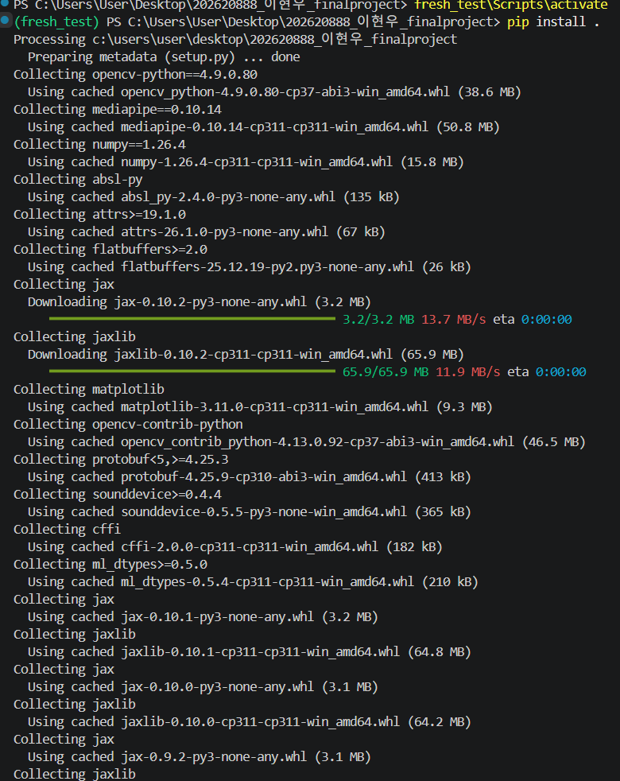
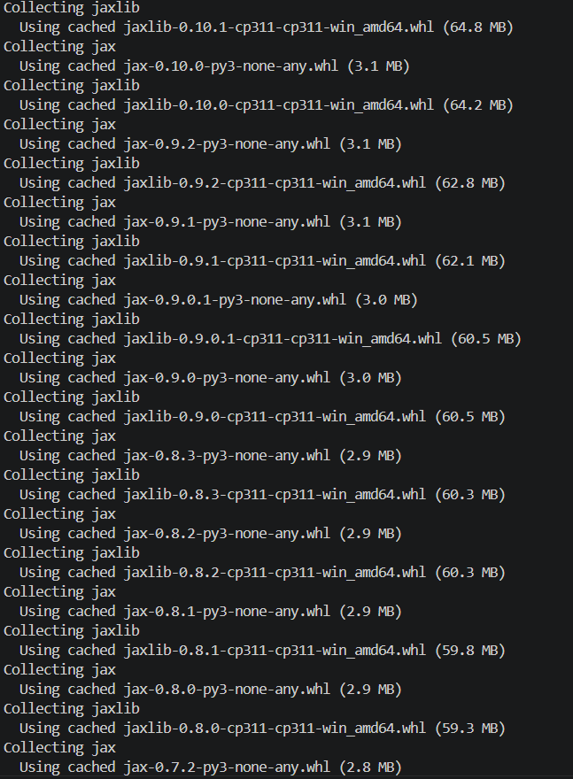
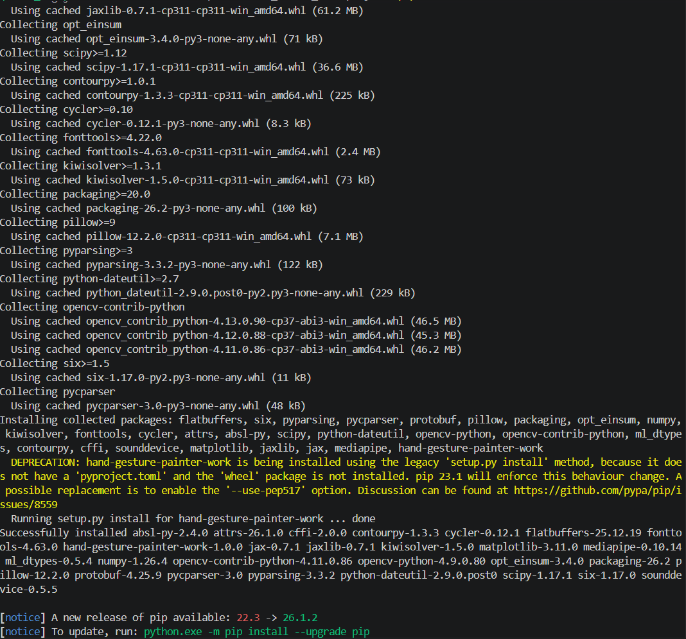

pytest 실행결과
(.venv) C:\Users\User\Desktop\hand_gesture_painter_work>pytest -v
======================================= test session starts ========================================
platform win32 -- Python 3.11.0, pytest-8.1.1, pluggy-1.6.0 -- C:\Users\User\Desktop\hand_gesture_painter_work\.venv\Scripts\python.exe
cachedir: .pytest_cache
rootdir: C:\Users\User\Desktop\hand_gesture_painter_work
collected 13 items                                                                                  

tests/test_core.py::test_find_positions_none_image PASSED                                     [  7%]
tests/test_core.py::test_is_valid_list_normal_data PASSED                                     [ 15%]
tests/test_core.py::test_is_valid_list_none_input INFO: Created TensorFlow Lite XNNPACK delegate for CPU.
PASSED                                      [ 23%]
tests/test_core.py::test_is_valid_list_empty_list PASSED                                      [ 30%]
tests/test_subclass.py::test_gesture_painter_color_initialization PASSED                      [ 38%]
tests/test_subclass.py::test_is_drawing_mode_none_input PASSED                                [ 46%]
tests/test_subclass.py::test_is_drawing_mode_empty_list PASSED                                [ 53%]
tests/test_subclass.py::test_is_drawing_mode_boundary_equal_coordinates PASSED                [ 61%]
tests/test_subclass.py::test_is_drawing_mode_invalid_primitive_type PASSED                    [ 69%]
tests/test_subclass.py::test_draw_canvas_accumulates_lines PASSED                             [ 76%]
tests/test_utils.py::test_calculate_distance_normal_coordinates PASSED                        [ 84%]
tests/test_utils.py::test_calculate_distance_boundary_zero PASSED                             [ 92%]
tests/test_utils.py::test_calculate_distance_invalid_primitive_type PASSED                    [100%]
W0000 00:00:1781443285.985803  170396 inference_feedback_manager.cc:114] Feedback manager requires a model with a single signature inference. Disabling support for feedback tensors.

======================================== 13 passed in 1.94s ========================================
W0000 00:00:1781443286.060330  171588 inference_feedback_manager.cc:114] Feedback manager requires a model with a single signature inference. Disabling support for feedback tensors.
W0000 00:00:1781443286.073978  172252 inference_feedback_manager.cc:114] Feedback manager requires a model with a single signature inference. Disabling support for feedback tensors.
W0000 00:00:1781443286.080406  173776 inference_feedback_manager.cc:114] Feedback manager requires a model with a single signature inference. Disabling support for feedback tensors.

pycodestyle 실행결과

(.venv) C:\Users\User\Desktop\hand_gesture_painter_work>pycodestyle my_package/

pip install . 출력 캡처

PS C:\Users\User\Desktop\202620888_이현우_finalproject> fresh_test\Scripts\activate
(fresh_test) PS C:\Users\User\Desktop\202620888_이현우_finalproject> pip install .
Processing c:\users\user\desktop\202620888_이현우_finalproject
  Preparing metadata (setup.py) ... done
Collecting opencv-python==4.9.0.80
  Using cached opencv_python-4.9.0.80-cp37-abi3-win_amd64.whl (38.6 MB)
Collecting mediapipe==0.10.14
  Using cached mediapipe-0.10.14-cp311-cp311-win_amd64.whl (50.8 MB)
Collecting numpy==1.26.4
  Using cached numpy-1.26.4-cp311-cp311-win_amd64.whl (15.8 MB)
Collecting absl-py
  Using cached absl_py-2.4.0-py3-none-any.whl (135 kB)
Collecting attrs>=19.1.0
  Using cached attrs-26.1.0-py3-none-any.whl (67 kB)
Collecting flatbuffers>=2.0
  Using cached flatbuffers-25.12.19-py2.py3-none-any.whl (26 kB)
Collecting jax
  Downloading jax-0.10.2-py3-none-any.whl (3.2 MB)
     ━━━━━━━━━━━━━━━━━━━━━━━━━━━━━━━━━━━━━━━━ 3.2/3.2 MB 13.7 MB/s eta 0:00:00
Collecting jaxlib
  Downloading jaxlib-0.10.2-cp311-cp311-win_amd64.whl (65.9 MB)
     ━━━━━━━━━━━━━━━━━━━━━━━━━━━━━━━━━━━━━━━━ 65.9/65.9 MB 11.9 MB/s eta 0:00:00
Collecting matplotlib
  Using cached matplotlib-3.11.0-cp311-cp311-win_amd64.whl (9.3 MB)
Collecting opencv-contrib-python
  Using cached opencv_contrib_python-4.13.0.92-cp37-abi3-win_amd64.whl (46.5 MB)
Collecting protobuf<5,>=4.25.3
  Using cached protobuf-4.25.9-cp310-abi3-win_amd64.whl (413 kB)
Collecting sounddevice>=0.4.4
  Using cached sounddevice-0.5.5-py3-none-win_amd64.whl (365 kB)
Collecting cffi
  Using cached cffi-2.0.0-cp311-cp311-win_amd64.whl (182 kB)
Collecting ml_dtypes>=0.5.0
  Using cached ml_dtypes-0.5.4-cp311-cp311-win_amd64.whl (210 kB)
Collecting jax
  Using cached jax-0.10.1-py3-none-any.whl (3.2 MB)
Collecting jaxlib
  Using cached jaxlib-0.10.1-cp311-cp311-win_amd64.whl (64.8 MB)
Collecting jax
  Using cached jax-0.10.0-py3-none-any.whl (3.1 MB)
Collecting jaxlib
  Using cached jaxlib-0.10.0-cp311-cp311-win_amd64.whl (64.2 MB)
Collecting jax
  Using cached jax-0.9.2-py3-none-any.whl (3.1 MB)
Collecting jaxlib
  Using cached jaxlib-0.9.2-cp311-cp311-win_amd64.whl (62.8 MB)
Collecting jax
  Using cached jax-0.9.1-py3-none-any.whl (3.1 MB)
Collecting jaxlib
  Using cached jaxlib-0.9.1-cp311-cp311-win_amd64.whl (62.1 MB)
Collecting jax
  Using cached jax-0.9.0.1-py3-none-any.whl (3.0 MB)
Collecting jaxlib
  Using cached jaxlib-0.9.0.1-cp311-cp311-win_amd64.whl (60.5 MB)
Collecting jax
  Using cached jax-0.9.0-py3-none-any.whl (3.0 MB)
Collecting jaxlib
  Using cached jaxlib-0.9.0-cp311-cp311-win_amd64.whl (60.5 MB)
Collecting jax
  Using cached jax-0.8.3-py3-none-any.whl (2.9 MB)
Collecting jaxlib
  Using cached jaxlib-0.8.3-cp311-cp311-win_amd64.whl (60.3 MB)
Collecting jax
  Using cached jax-0.8.2-py3-none-any.whl (2.9 MB)
Collecting jaxlib
  Using cached jaxlib-0.8.2-cp311-cp311-win_amd64.whl (60.3 MB)
Collecting jax
  Using cached jax-0.8.1-py3-none-any.whl (2.9 MB)
Collecting jaxlib
  Using cached jaxlib-0.8.1-cp311-cp311-win_amd64.whl (59.8 MB)
Collecting jax
  Using cached jax-0.8.0-py3-none-any.whl (2.9 MB)
Collecting jaxlib
  Using cached jaxlib-0.8.0-cp311-cp311-win_amd64.whl (59.3 MB)
Collecting jax
  Using cached jax-0.7.2-py3-none-any.whl (2.8 MB)
Collecting jaxlib
  Using cached jaxlib-0.7.2-cp311-cp311-win_amd64.whl (58.0 MB)
Collecting jax
  Using cached jax-0.7.1-py3-none-any.whl (2.8 MB)
Collecting jaxlib
  Using cached jaxlib-0.7.1-cp311-cp311-win_amd64.whl (61.2 MB)
Collecting opt_einsum
  Using cached opt_einsum-3.4.0-py3-none-any.whl (71 kB)
Collecting scipy>=1.12
  Using cached scipy-1.17.1-cp311-cp311-win_amd64.whl (36.6 MB)
Collecting contourpy>=1.0.1
  Using cached contourpy-1.3.3-cp311-cp311-win_amd64.whl (225 kB)
Collecting cycler>=0.10
  Using cached cycler-0.12.1-py3-none-any.whl (8.3 kB)
Collecting fonttools>=4.22.0
  Using cached fonttools-4.63.0-cp311-cp311-win_amd64.whl (2.4 MB)
Collecting kiwisolver>=1.3.1
  Using cached kiwisolver-1.5.0-cp311-cp311-win_amd64.whl (73 kB)
Collecting packaging>=20.0
  Using cached packaging-26.2-py3-none-any.whl (100 kB)
Collecting pillow>=9
  Using cached pillow-12.2.0-cp311-cp311-win_amd64.whl (7.1 MB)
Collecting pyparsing>=3
  Using cached pyparsing-3.3.2-py3-none-any.whl (122 kB)
Collecting python-dateutil>=2.7
  Using cached python_dateutil-2.9.0.post0-py2.py3-none-any.whl (229 kB)
Collecting opencv-contrib-python
  Using cached opencv_contrib_python-4.13.0.90-cp37-abi3-win_amd64.whl (46.5 MB)
  Using cached opencv_contrib_python-4.12.0.88-cp37-abi3-win_amd64.whl (45.3 MB)
  Using cached opencv_contrib_python-4.11.0.86-cp37-abi3-win_amd64.whl (46.2 MB)
Collecting six>=1.5
  Using cached six-1.17.0-py2.py3-none-any.whl (11 kB)
Collecting pycparser
  Using cached pycparser-3.0-py3-none-any.whl (48 kB)
Installing collected packages: flatbuffers, six, pyparsing, pycparser, protobuf, pillow, packaging, opt_einsum, numpy, kiwisolver, fonttools, cycler, attrs, absl-py, scipy, python-dateutil, opencv-python, opencv-contrib-python, ml_dtypes, contourpy, cffi, sounddevice, matplotlib, jaxlib, jax, mediapipe, hand-gesture-painter-work
  DEPRECATION: hand-gesture-painter-work is being installed using the legacy 'setup.py install' method, because it does not have a 'pyproject.toml' and the 'wheel' package is not installed. pip 23.1 will enforce this behaviour change. A possible replacement is to enable the '--use-pep517' option. Discussion can be found at https://github.com/pypa/pip/issues/8559
  Running setup.py install for hand-gesture-painter-work ... done
Successfully installed absl-py-2.4.0 attrs-26.1.0 cffi-2.0.0 contourpy-1.3.3 cycler-0.12.1 flatbuffers-25.12.19 fonttools-4.63.0 hand-gesture-painter-work-1.0.0 jax-0.7.1 jaxlib-0.7.1 kiwisolver-1.5.0 matplotlib-3.11.0 mediapipe-0.10.14 ml_dtypes-0.5.4 numpy-1.26.4 opencv-contrib-python-4.11.0.86 opencv-python-4.9.0.80 opt_einsum-3.4.0 packaging-26.2 pillow-12.2.0 protobuf-4.25.9 pycparser-3.0 pyparsing-3.3.2 python-dateutil-2.9.0.post0 scipy-1.17.1 six-1.17.0 sounddevice-0.5.5

[notice] A new release of pip available: 22.3 -> 26.1.2
[notice] To update, run: python.exe -m pip install --upgrade pip

